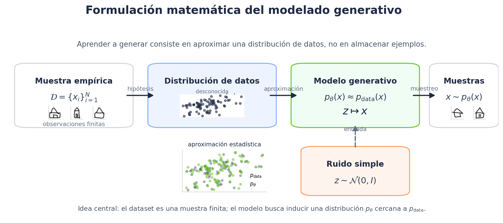

# Modelos de difusion para IA generativa: Fundamentos

Unidad ejecutable del Semillero GIDSYC para estudiar, mediante notebooks reproducibles, los fundamentos de los modelos de difusion generativa: ruido gaussiano, proceso directo, denoising, muestreo inverso, condicionamiento, classifier-free guidance, score matching, flow matching y espacios latentes.

El curso tiene proposito formativo y experimental. No busca entrenar un generador competitivo ni reemplaza el estudio de sistemas generativos modernos a gran escala. Su objetivo es formar criterio tecnico sobre los mecanismos matematicos y computacionales que hacen posible la generacion por difusion.

<p align="center">
  
</p>

<p align="center"><em>Aprender a generar consiste en aproximar una distribucion de datos y muestrear desde ella.</em></p>

## Inicio rapido

Abra esta carpeta como raiz del proyecto:

```text
courses/modelos_difusion_ia_generativa/
```

Instale las dependencias:

```bash
pip install -r requirements.txt
```

Abra JupyterLab desde la raiz del curso:

```bash
jupyter lab
```

Luego ejecute los notebooks en orden, seleccionando el kernel de Python configurado para el curso.

## Documentos principales

- `syllabus.pdf`: proposito academico, resultados de aprendizaje, modulos y evaluacion sugerida.
- `guia_configuracion_curso/guia_configuracion_curso.pdf`: instalacion del entorno, datasets, checkpoints y verificaciones operativas.
- `docs/ruta_notebooks.pdf`: secuencia conceptual de notebooks.
- `assets/audio/presentacion_curso.mp3`: audio breve de presentacion del curso.

## Estructura de la carpeta

```text
notebooks/                  Cuadernos ejecutables del curso
materiales/                 Notas tecnicas publicas por notebook
guia_configuracion_curso/   Guia operativa del entorno
assets/                     Branding, figuras y recursos de apoyo
data/                       Datasets procesados usados por los notebooks
models/                     Checkpoints pequenos usados por notebooks posteriores
src/                        Utilidades de Python usadas por notebooks
docs/                       Documentacion auxiliar para estudiantes
```

## Ruta de notebooks

```text
00_distribuciones_de_datos_y_modelado_generativo.ipynb
01_ruido_gaussiano_y_espacios_de_datos.ipynb
02_procesos_de_difusion_directa.ipynb
03_denoising_y_objetivos_de_entrenamiento.ipynb
04_modelo_ddpm_no_condicional_prediccion_ruido.ipynb
05_muestreo_iterativo_y_evaluacion_cualitativa.ipynb
06_mezclas_de_distribuciones_y_estructura_semantica.ipynb
07_modelos_de_difusion_condicionales.ipynb
08_classifier_free_guidance.ipynb
09_score_matching_e_intuicion_geometrica.ipynb
10_flow_matching_y_transporte_de_probabilidad.ipynb
11_espacios_latentes_y_arquitecturas_generativas_modernas.ipynb
```

## Datos y checkpoints

El curso incluye los archivos necesarios para ejecutar la ruta estandar:

```text
data/quickdraw/processed/quickdraw_house_50k_28x28.npz
data/quickdraw/processed/quickdraw_5class_10k_each_28x28.npz
models/quickdraw_house_ddpm_tiny_unet.pt
models/quickdraw_5class_conditional_tiny_unet.pt
models/quickdraw_5class_cfg_tiny_unet.pt
```

Los datasets procesados provienen de QuickDraw, publicado por Google Creative Lab bajo licencia CC BY 4.0:

```text
https://github.com/googlecreativelab/quickdraw-dataset
```

La guia de configuracion explica como verificar estos archivos. Los checkpoints permiten estudiar muestreo, condicionamiento y guidance sin repetir entrenamientos completos.

## Entorno

Se recomienda Python 3.10 o superior, JupyterLab, NumPy, Matplotlib y PyTorch. Los notebooks de entrenamiento y muestreo usan GPU cuando `torch.cuda.is_available()` es verdadero, pero varias secciones conceptuales pueden ejecutarse en CPU.

En otra maquina puede usarse cualquier kernel equivalente que tenga instaladas las dependencias de `requirements.txt`.

## Materiales de estudio

Cada notebook cerrado tiene una nota tecnica en:

```text
materiales/<nn_slug_notebook>/nota_tecnica.pdf
```

Use esas notas como lectura de apoyo antes o despues de ejecutar el notebook correspondiente.
